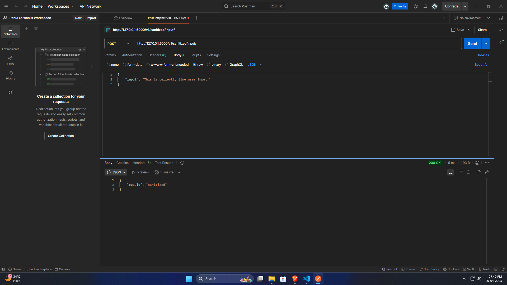
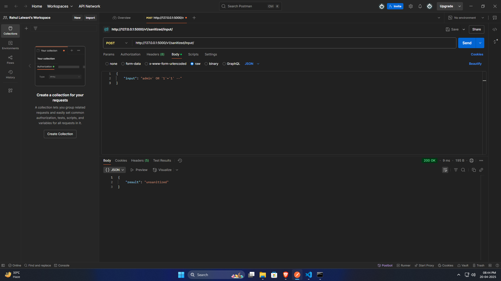
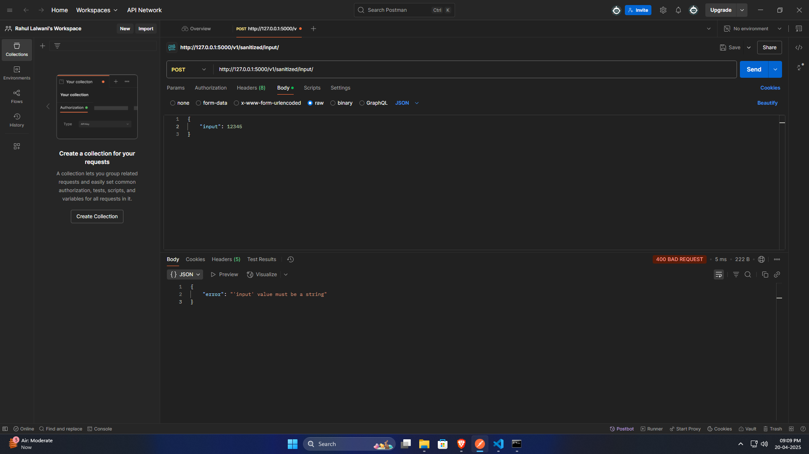

# SQL Injection Sanitizer API

A Flask-based API that validates input strings for potential SQL injection attempts. This assignment implements an endpoint that checks whether a provided input string contains SQL injection characters and returns a sanitization status.

## Table of Contents

- [Assignment Overview](#assignment-overview)
- [Features](#features)
- [Installation](#installation)
- [Usage](#usage)
- [API Documentation](#api-documentation)
- [Code Structure](#code-structure)
- [Testing](#testing)
- [Screenshots](#screenshots)
- [Author](#author)

## Assignment Overview

**Python Task:** Build an API in Flask that detects SQL injection attempts in input strings.

**Timeline:** 4 days (Due: 21st April)

**Requirements:**
1. Input through payload in Postman
2. Structured and easily maintainable code
3. Unit testing with pytest

This API service examines input strings for suspicious characters and patterns commonly used in SQL injection attacks. The service accepts JSON payloads via POST requests and returns a sanitization status.

## Features

- Flask API implementing the required endpoint
- SQL injection detection (within `app/utils.py`)
- JSON response format following assignment specifications
- Comprehensive unit tests with pytest
- Clean and maintainable code structure

## Installation

1. Clone this repository:
   ```bash
   git clone https://github.com/rahullalwani007/sql-sanitizer-assignment.git
   cd sql-sanitizer-assignment
   ```

*(Note: Ensure the directory name matches your local setup, e.g., `cd "sql sanitizer"` if that's the folder name)*

2.  Create and activate a virtual environment (recommended):

    ```bash
    python -m venv venv
    # On Windows use: venv\Scripts\activate
    # On macOS/Linux use: source venv/bin/activate
    source venv/bin/activate
    ```

3.  Install dependencies:

    ```bash
    pip install -r requirements.txt
    ```

## Usage

1.  Start the Flask application:

    ```bash
    # Ensure your virtual environment is activated
    python run.py
    ```

2.  The API will be available at `http://127.0.0.1:5000` (or the port specified in `run.py`).

3.  Use Postman to send a POST request to `/v1/sanitized/input/` with a JSON payload containing the input to be checked.

## API Documentation

### Endpoint: `/v1/sanitized/input/`

**Method:** `POST`

**URL:** `http://127.0.0.1:5000/v1/sanitized/input/`

**Request Body (raw JSON):**

```json
{
  "input": "string to check for SQL injection"
}
```

**Response:**

  - For sanitized input:

    ```json
    {
      "result": "sanitized"
    }
    ```

  - For potential SQL injection attempts:

    ```json
    {
      "result": "unsanitized"
    }
    ```

**Status Codes:**

  - `200 OK`: Request processed successfully.
  - `400 Bad Request`: Missing or invalid input (e.g., no "input" key, or value is not a string).
  - `500 Internal Server Error`: Unexpected server-side error during processing.

## Code Structure

The project follows a clean and maintainable structure based on the uploaded files:

```
sql sanitizer/                  # Root project folder
├── app/                        # Main application package
│   ├── __init__.py             # Application factory, initializes Flask app
│   ├── routes.py               # Defines API endpoints/routes
│   └── utils.py                # Contains the SQL injection detection logic
├── tests/                      # Contains unit tests
│   └── test_api.py             # Pytest tests for the API endpoint
├── postman_screenshots/        # Directory for Postman screenshots
│   └── (your screenshots...)   # e.g., sanitized_input.png, etc.
├── venv/                       # Virtual environment directory (usually gitignored)
├── run.py                      # Script to run the Flask application
├── requirements.txt            # Project dependencies
└── README.md                   # This documentation file
```

## Testing

This project uses `pytest` for unit testing as specified in the requirements. To run the tests:

1.  Ensure your virtual environment is activated.
2.  Run the following command from the project root directory:
    ```bash
    pytest
    ```

The tests (`tests/test_api.py`) cover:

  - Valid inputs that should be marked as sanitized.
  - Various SQL injection patterns that should be detected as unsanitized.
  - Edge cases like empty strings.
  - API response format and status code validation.

## Screenshots

Below are screenshots demonstrating how to use the API with Postman as requested in the assignment:

### Sanitized Input Example


*This screenshot shows a successful request with sanitized input.*

### Unsanitized Input Example


*This screenshot shows a request with potential SQL injection characters.*

### Invalid Request Example


*This screenshot shows an example of an invalid request missing the required input field.*

## Author

Rahul Lalwani
